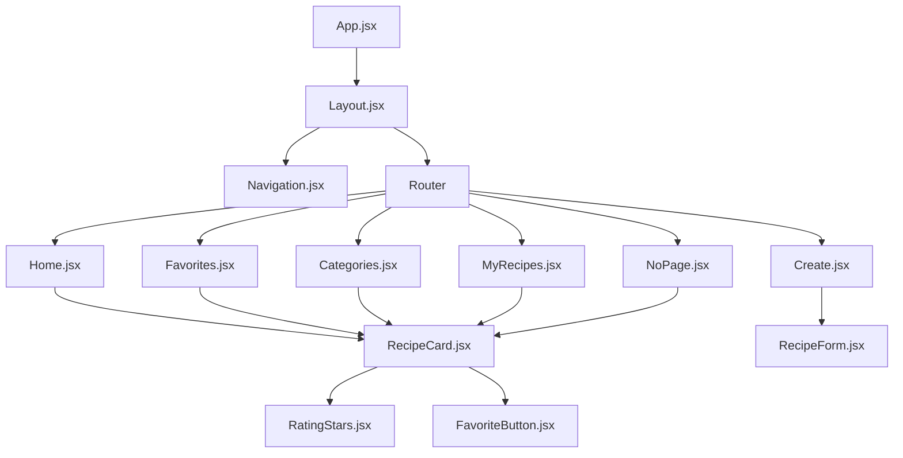
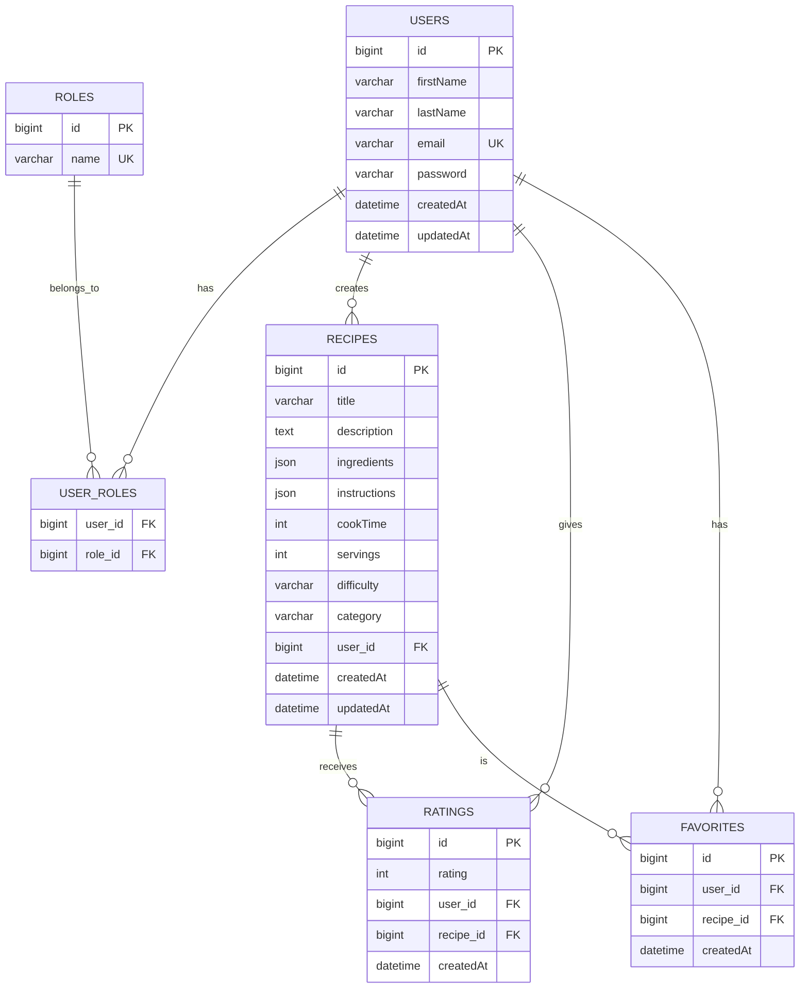

# 🏗️ Architektur-Dokumentation - Rate My Recipe

## 📋 Übersicht

Diese Dokumentation beschreibt die technische Architektur der "Rate My Recipe" Anwendung, einschließlich Backend- und Frontend-Struktur, Datenfluss und Design-Entscheidungen.

---

## 🎯 Architektur-Prinzipien

### 1. **Separation of Concerns**
- Klare Trennung zwischen Frontend, Backend und Datenbank
- Modulare Komponenten-Struktur
- Single Responsibility Principle

### 2. **RESTful API Design**
- Standardisierte HTTP-Methoden
- Konsistente URL-Struktur
- Stateless Communication

### 3. **Security First**
- JWT-basierte Authentifizierung
- Input-Validierung auf allen Ebenen
- HTTPS-Verschlüsselung

### 4. **Scalability**
- Horizontale Skalierbarkeit durch stateless Backend
- Caching-Strategien
- Optimierte Datenbankabfragen

---

## 🖥️ Backend-Architektur

### 📁 Paket-Struktur

```
com.example.RateMyRecipe/
├── Controller/           # REST-Controller
│   ├── AuthController.java
│   ├── RecipeController.java
│   ├── RatingController.java
│   └── FavoriteController.java
├── Model/               # JPA-Entities
│   ├── User.java
│   ├── Recipe.java
│   ├── Rating.java
│   └── Favorite.java
├── repositories/        # Data Access Layer
│   ├── UserRepository.java
│   ├── RecipeRepository.java
│   ├── RatingRepository.java
│   └── FavoriteRepository.java
├── Services/           # Business Logic Layer
│   ├── UserService.java
│   ├── RecipeService.java
│   ├── RatingService.java
│   └── FavoriteService.java
├── Security/           # Security Configuration
│   ├── SecurityConfiguration.java
│   ├── JwtUtils.java
│   ├── AuthTokenFilter.java
│   └── UserDetailsServiceImpl.java
└── dto/               # Data Transfer Objects
    ├── LoginRequest.java
    ├── SignupRequest.java
    └── JwtResponse.java
```

### 🔄 Datenfluss

```
HTTP Request → Controller → Service → Repository → Database
                ↓
HTTP Response ← DTO ← Service ← Repository ← Database
```

### 📊 Klassen-Diagramm

```mermaid
classDiagram
    class User {
        +Long id
        +String firstName
        +String lastName
        +String email
        +String password
        +Set~Role~ roles
        +List~Recipe~ recipes
        +List~Rating~ ratings
        +List~Favorite~ favorites
    }

    class Recipe {
        +Long id
        +String title
        +String description
        +List~String~ ingredients
        +List~String~ instructions
        +Integer cookTime
        +Integer servings
        +String difficulty
        +String category
        +User user
        +List~Rating~ ratings
        +List~Favorite~ favorites
    }

    class Rating {
        +Long id
        +Integer rating
        +User user
        +Recipe recipe
        +LocalDateTime createdAt
    }

    class Favorite {
        +Long id
        +User user
        +Recipe recipe
        +LocalDateTime createdAt
    }

    class RecipeController {
        +getAllRecipes()
        +getRecipeById()
        +createRecipe()
        +updateRecipe()
        +deleteRecipe()
    }

    class RecipeService {
        +getAllRecipes()
        +getRecipeById()
        +createRecipe()
        +updateRecipe()
        +deleteRecipe()
    }

    class RecipeRepository {
        +findAll()
        +findById()
        +save()
        +delete()
        +findByCategory()
        +findByUserId()
    }

    User ||--o{ Recipe : creates
    User ||--o{ Rating : gives
    User ||--o{ Favorite : has
    Recipe ||--o{ Rating : receives
    Recipe ||--o{ Favorite : is
    RecipeController --> RecipeService
    RecipeService --> RecipeRepository
    RecipeRepository --> Recipe
```

### 🔐 Security-Architektur

#### JWT-Token-Flow

```
1. User Login → AuthController
2. Validate Credentials → UserDetailsService
3. Generate JWT → JwtUtils
4. Return Token → Client
5. Client includes Token in Header
6. Validate Token → AuthTokenFilter
7. Set Security Context → Spring Security
```

#### Security-Konfiguration

```java
@Configuration
@EnableWebSecurity
public class SecurityConfiguration {
    
    @Bean
    public SecurityFilterChain filterChain(HttpSecurity http) {
        http.csrf(csrf -> csrf.disable())
            .cors(cors -> cors.configurationSource(corsConfigurationSource()))
            .sessionManagement(session -> session.sessionCreationPolicy(SessionCreationPolicy.STATELESS))
            .authorizeHttpRequests(auth -> auth
                .requestMatchers("/api/auth/**").permitAll()
                .requestMatchers("/api/recipes").permitAll()
                .anyRequest().authenticated()
            )
            .addFilterBefore(authenticationJwtTokenFilter(), UsernamePasswordAuthenticationFilter.class);
        
        return http.build();
    }
}
```

---

## 🎨 Frontend-Architektur

### 📁 Komponenten-Struktur

```
src/
├── modules/              # Feature-basierte Module
│   ├── auth/            # Authentifizierung
│   │   ├── Login.jsx
│   │   └── Signup.jsx
│   ├── layout/          # Layout-Komponenten
│   │   ├── Layout.jsx
│   │   └── Navigation.jsx
│   ├── pages/           # Seiten-Komponenten
│   │   ├── Home.jsx
│   │   ├── Create.jsx
│   │   ├── Favorites.jsx
│   │   ├── Categories.jsx
│   │   ├── MyRecipes.jsx
│   │   └── NoPage.jsx
│   └── recipes/         # Rezept-bezogene Komponenten
│       ├── Recipe.jsx
│       ├── RecipeCard.jsx
│       └── RecipeData.jsx
├── services/            # API-Services
│   ├── auth.js
│   ├── recipes.js
│   ├── ratings.js
│   └── favorites.js
├── styles/              # CSS-Dateien
│   ├── index.css
│   ├── App.css
│   ├── Home.css
│   └── Navigation.css
└── test/                # Test-Dateien
    ├── setup.js
    └── *.test.jsx
```

### 🔄 Komponenten-Hierarchie



### 🎯 State-Management

#### Context API Struktur

```javascript
// AuthContext.jsx
const AuthContext = createContext();

export const AuthProvider = ({ children }) => {
  const [user, setUser] = useState(null);
  const [token, setToken] = useState(localStorage.getItem('token'));
  const [loading, setLoading] = useState(false);

  const login = async (credentials) => {
    // Login-Logik
  };

  const logout = () => {
    // Logout-Logik
  };

  return (
    <AuthContext.Provider value={{ user, token, login, logout, loading }}>
      {children}
    </AuthContext.Provider>
  );
};
```

#### Service-Layer

```javascript
// recipes.js
const API_BASE_URL = 'http://localhost:8080/api';

export const recipeService = {
  async getAllRecipes() {
    const response = await axios.get(`${API_BASE_URL}/recipes`);
    return response.data;
  },

  async createRecipe(recipeData) {
    const token = localStorage.getItem('token');
    const response = await axios.post(`${API_BASE_URL}/recipes`, recipeData, {
      headers: { Authorization: `Bearer ${token}` }
    });
    return response.data;
  }
};
```

---

## 🗄️ Datenbank-Architektur

### 📊 ER-Diagramm



### 🔍 Indizes

```sql
-- Performance-Optimierung
CREATE INDEX idx_recipes_category ON recipes(category);
CREATE INDEX idx_recipes_user_id ON recipes(user_id);
CREATE INDEX idx_ratings_recipe_id ON ratings(recipe_id);
CREATE INDEX idx_favorites_user_id ON favorites(user_id);
CREATE INDEX idx_favorites_recipe_id ON favorites(recipe_id);
CREATE INDEX idx_users_email ON users(email);
```

---

## 🔄 API-Design

### 📋 REST-Endpunkte

| HTTP-Methode | Endpunkt | Beschreibung | Authentifizierung |
|--------------|----------|--------------|-------------------|
| POST | `/api/auth/signup` | Benutzer registrieren | Nein |
| POST | `/api/auth/login` | Benutzer anmelden | Nein |
| GET | `/api/recipes` | Alle Rezepte abrufen | Nein |
| GET | `/api/recipes/{id}` | Einzelnes Rezept abrufen | Nein |
| POST | `/api/recipes` | Rezept erstellen | Ja |
| PUT | `/api/recipes/{id}` | Rezept aktualisieren | Ja |
| DELETE | `/api/recipes/{id}` | Rezept löschen | Ja |
| GET | `/api/recipes/category/{category}` | Rezepte nach Kategorie | Nein |
| GET | `/api/recipes/user/{userId}` | Rezepte nach Benutzer | Nein |
| POST | `/api/ratings` | Rezept bewerten | Ja |
| GET | `/api/favorites` | Favoriten abrufen | Ja |
| POST | `/api/favorites` | Favorit hinzufügen | Ja |
| DELETE | `/api/favorites/{recipeId}` | Favorit entfernen | Ja |

### 📤 Request/Response-Formate

#### Recipe-Erstellung
```json
// POST /api/recipes
{
  "title": "Pasta Carbonara",
  "description": "Klassische italienische Pasta",
  "ingredients": ["Pasta", "Eier", "Parmesan", "Pancetta"],
  "instructions": ["Pasta kochen", "Sauce zubereiten"],
  "cookTime": 30,
  "servings": 4,
  "difficulty": "MITTEL",
  "category": "HAUPTGERICHT"
}

// Response
{
  "id": 1,
  "title": "Pasta Carbonara",
  "description": "Klassische italienische Pasta",
  "ingredients": ["Pasta", "Eier", "Parmesan", "Pancetta"],
  "instructions": ["Pasta kochen", "Sauce zubereiten"],
  "cookTime": 30,
  "servings": 4,
  "difficulty": "MITTEL",
  "category": "HAUPTGERICHT",
  "user": {
    "id": 1,
    "firstName": "Max",
    "lastName": "Mustermann"
  },
  "rating": null,
  "ratingCount": 0,
  "createdAt": "2024-01-15T10:30:00Z"
}
```

---

## 🚀 Deployment-Architektur

### 📦 Container-Struktur

```yaml
# docker-compose.yml
version: '3.8'
services:
  frontend:
    build: ./frontend
    ports:
      - "3000:3000"
    environment:
      - REACT_APP_API_URL=http://localhost:8080/api
    depends_on:
      - backend

  backend:
    build: ./backend
    ports:
      - "8080:8080"
    environment:
      - SPRING_DATASOURCE_URL=jdbc:mysql://db:3306/ratemyrecipe
      - SPRING_DATASOURCE_USERNAME=ratemyrecipe_user
      - SPRING_DATASOURCE_PASSWORD=secure_password
    depends_on:
      - db

  db:
    image: mysql:8.0
    ports:
      - "3306:3306"
    environment:
      - MYSQL_DATABASE=ratemyrecipe
      - MYSQL_USER=ratemyrecipe_user
      - MYSQL_PASSWORD=secure_password
      - MYSQL_ROOT_PASSWORD=root_password
    volumes:
      - mysql_data:/var/lib/mysql

volumes:
  mysql_data:
```

### 🌐 Produktions-Architektur

```
Internet → Load Balancer → Frontend (CDN) → Backend (Auto-Scaling) → Database (RDS)
```

---

## 🔧 Technische Entscheidungen

### Backend-Technologien

| Technologie | Version | Begründung |
|-------------|---------|------------|
| Spring Boot | 3.2.0 | Enterprise-ready, umfangreiches Ökosystem |
| Spring Security | 6.2.0 | Robuste Sicherheitslösung |
| Spring Data JPA | 3.2.0 | Einfache Datenbankintegration |
| MySQL | 8.0 | Bewährte relationale Datenbank |
| JWT | 0.11.5 | Stateless Authentifizierung |
| Maven | 3.9.0 | Dependency Management |

### Frontend-Technologien

| Technologie | Version | Begründung |
|-------------|---------|------------|
| React | 19.0.0 | Moderne UI-Bibliothek |
| Vite | 5.0.0 | Schneller Build-Tool |
| Tailwind CSS | 3.4.0 | Utility-First CSS Framework |
| React Router | 6.20.0 | Client-side Routing |
| Axios | 1.6.0 | HTTP-Client |
| Vitest | 1.0.0 | Unit-Testing |

### Design-Entscheidungen

1. **Monolithische Backend-Architektur**
   - Einfach zu entwickeln und deployen
   - Geeignet für MVP und kleine Teams
   - Einfache Datenbanktransaktionen

2. **Component-Based Frontend**
   - Wiederverwendbare Komponenten
   - Einfache Wartung und Erweiterung
   - Klare Trennung von Concerns

3. **RESTful API**
   - Standardisierte Kommunikation
   - Einfache Integration
   - Caching-Möglichkeiten

---

## 📈 Performance-Optimierungen

### Backend-Optimierungen

1. **Datenbank-Indizes**
   - Optimierte Abfragen für häufige Operationen
   - Composite-Indizes für komplexe Queries

2. **Caching-Strategien**
   - Redis für Session-Management
   - HTTP-Caching für statische Inhalte

3. **Connection Pooling**
   - HikariCP für Datenbankverbindungen
   - Optimierte Pool-Größen

### Frontend-Optimierungen

1. **Code-Splitting**
   - Lazy Loading für Routen
   - Dynamische Imports

2. **Bundle-Optimierung**
   - Tree Shaking
   - Minification
   - Gzip-Kompression

3. **Image-Optimierung**
   - WebP-Format
   - Responsive Images
   - Lazy Loading

---

## 🔒 Sicherheitsmaßnahmen

### Backend-Sicherheit

1. **Authentifizierung**
   - JWT-Token mit kurzer Gültigkeit
   - Refresh-Token-Mechanismus
   - Sichere Passwort-Hashing (BCrypt)

2. **Autorisierung**
   - Role-based Access Control (RBAC)
   - Method-level Security
   - URL-basierte Berechtigungen

3. **Input-Validierung**
   - Bean Validation
   - SQL-Injection-Schutz
   - XSS-Prevention

### Frontend-Sicherheit

1. **Client-Side Security**
   - HTTPS-Erzwingung
   - Content Security Policy (CSP)
   - XSS-Schutz

2. **Token-Management**
   - Sichere Token-Speicherung
   - Automatische Token-Erneuerung
   - Logout-Funktionalität

---

## 🧪 Testing-Strategie

### Backend-Tests

1. **Unit-Tests**
   - Service-Layer Tests
   - Repository-Layer Tests
   - Utility-Klassen Tests

2. **Integration-Tests**
   - Controller-Tests
   - Datenbank-Integration
   - Security-Tests

3. **End-to-End-Tests**
   - API-Endpunkt-Tests
   - Authentifizierungs-Flow
   - Datenbank-Transaktionen

### Frontend-Tests

1. **Unit-Tests**
   - Komponenten-Tests
   - Service-Tests
   - Utility-Funktionen

2. **Integration-Tests**
   - API-Integration
   - State-Management
   - Routing-Tests

3. **E2E-Tests**
   - Benutzer-Flows
   - Cross-Browser-Tests
   - Performance-Tests

---

## 📊 Monitoring & Logging

### Backend-Monitoring

1. **Application Metrics**
   - Spring Boot Actuator
   - Custom Metrics
   - Health Checks

2. **Logging**
   - Structured Logging (JSON)
   - Log-Levels
   - Centralized Logging

3. **Performance Monitoring**
   - Response Times
   - Database Queries
   - Memory Usage

### Frontend-Monitoring

1. **Error Tracking**
   - JavaScript Error Monitoring
   - Performance Monitoring
   - User Experience Tracking

2. **Analytics**
   - User Behavior
   - Feature Usage
   - Performance Metrics

---

## 🔄 CI/CD-Pipeline

### GitHub Actions Workflow

```yaml
name: CI/CD Pipeline

on:
  push:
    branches: [ main, develop ]
  pull_request:
    branches: [ main ]

jobs:
  test:
    runs-on: ubuntu-latest
    steps:
      - uses: actions/checkout@v3
      - name: Setup Java
        uses: actions/setup-java@v3
        with:
          java-version: '17'
      - name: Setup Node.js
        uses: actions/setup-node@v3
        with:
          node-version: '18'
      - name: Run Backend Tests
        run: cd backend && mvn test
      - name: Run Frontend Tests
        run: cd frontend && npm test

  deploy:
    needs: test
    runs-on: ubuntu-latest
    if: github.ref == 'refs/heads/main'
    steps:
      - name: Deploy to Production
        run: echo "Deploy to production"
```

---

## 📚 Fazit

Die "Rate My Recipe" Anwendung folgt modernen Architektur-Prinzipien und bewährten Praktiken:

- **Skalierbarkeit**: Horizontale Skalierung durch stateless Backend
- **Wartbarkeit**: Klare Trennung von Concerns und modulare Struktur
- **Sicherheit**: Umfassende Sicherheitsmaßnahmen auf allen Ebenen
- **Performance**: Optimierte Datenbankabfragen und Frontend-Bundle
- **Testbarkeit**: Umfassende Test-Suite für alle Komponenten

Die Architektur ermöglicht eine einfache Erweiterung um neue Features und eine effiziente Wartung der Anwendung. 